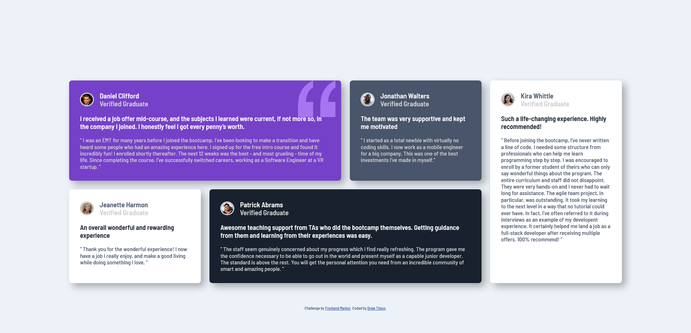

# Frontend Mentor - Testimonials grid section solution

This is a solution to the [Testimonials grid section challenge on Frontend Mentor](https://www.frontendmentor.io/challenges/testimonials-grid-section-Nnw6J7Un7). Frontend Mentor challenges help you improve your coding skills by building realistic projects. 

## Table of contents

- [Overview](#overview)
  - [The challenge](#the-challenge)
  - [Screenshot](#screenshot)
  - [Links](#links)
- [My process](#my-process)
  - [Built with](#built-with)
  - [What I learned](#what-i-learned)
  - [Continued development](#continued-development)
  - [Useful resources](#useful-resources)
- [Author](#author)

**Note: Delete this note and update the table of contents based on what sections you keep.**

## Overview

### The challenge

Users should be able to:

- View the optimal layout for the site depending on their device's screen size

### Screenshot

### Links

- Solution URL: [Add solution URL here](https://your-solution-url.com)
- Live Site URL: [Add live site URL here](https://your-live-site-url.com)

## My process

### Built with

- Semantic HTML5 markup
- CSS custom properties
- CSS Grid
- Mobile-first workflow

### What I learned

This is the first time using CSS Grid. I have only used flex box up tp this point
I found it easier to center a card on the screen with the code below

body {
    display: grid;
    place-content: center;
}

### Continued development

I need to work more on CSS Grid. It is very complex and a lot to learn, but its easier for certain layouts like this one

### Useful resources

https://css-tricks.com/snippets/css/complete-guide-grid/

## Author

- Website - [Drew Tilson] (https://github.com/MrWindFish)
- Frontend Mentor - [@MrWindFish](https://www.frontendmentor.io/profile/MrWindFish)
- Twitter - [@MrWindFish](https://www.twitter.com/MrWindFish)
